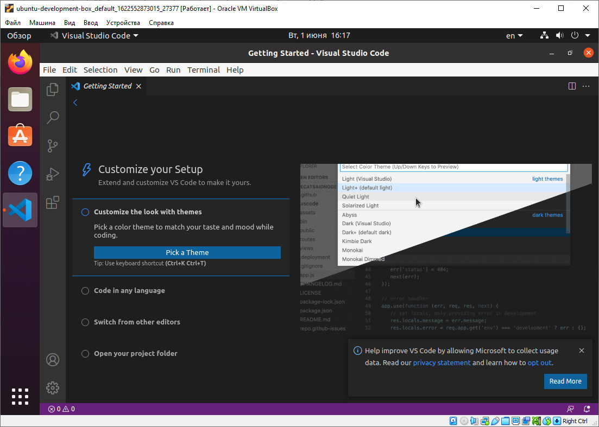

# Ubuntu Development Box

Graphical virtual desktop environment based on Ubuntu 20.04 for developers.



## System requirements

* Windows 10 with administrator permissions
* [VirtualBox](https://www.virtualbox.org/wiki/Downloads) 6.1+
* [Vagrant](https://www.vagrantup.com/downloads) 2.2+
* Minimum 15 Gb free disk space

## What Box includes

* Ubuntu 20.04 Desktop with Russian locale (my test Vagrant box is based on the [article](https://www.techlayman.net/docs/how-to-build-ubuntu-desktop-vagrant-box-from-scratch/))
* Git
* Ansible
* NVM (Node Version Manager)
* PHP 8
* Midnight Commander (mc)
* Docker with Docker Compose
* PhpStorm (see *Information* section)
* Visual Code
* DBeaver Community Edition

## How to use

Clone Ubuntu Development Box into any directory.

`git clone git@github.com:s-mokrushin/ubuntu-development-box.git`

Copy your private Git key to `ubuntu-development-box/id_rsa`.

Copy `.env.example` to `.env`. Edit limits.

## Settings recommendations

* `BOX_CPU_COUNT` - CPU cores dedicated to virtual machine. Recommended value = Total CPU cores / 2. Optimal - 4. Minimum - 1.
* `BOX_MEMORY_SIZE` - RAM size (in megabytes). Recommended = Total RAM / 2. Optimal - 8096. Minimum - 2048.
* `BOX_DISK_SIZE` - disk space used. Recommended - 75GB. It means only the maximum disk space that a virtual machine can use, but real starting disk usage is about 12 Gb.
* `BOX_IP_ADDRESS` - virtual machine local IP address.
* `BOX_HOSTNAME` - local hostname.

## Installation

Run the PowerShell in `ubuntu-development-box` folder and execute the following comand.

```bash
vagrant up

# during the first launch it will be needed to confirm plugins setup
# afterwards you’ll need to run the command one more time

vagrant up
```

Installation includes the following steps:

Virtual machine image is downloaded with Vagrant.
The new virtual machine is created and launched via VirtualBox.
During the first launch Vagrant will install VirtualBox Additions which are necessary for changing the screen resolution and turning on the functionality of the clipboard.
After restart all the needed components will be installed in the background process. This will take some time and you’ll be able to track the progress in the command line.

## Start

```bash
vagrant up
```

You need to wait a bit for the desktop to appear.

* Username: `vagrant`
* Password: `vagrant`

User has administrator permissions without password prompt: `sudo su`

## Upgrade

You can upgrade configuration to the latest version with the following commands.

```bash
git pull
vagrant up --provision
```

## Information
You can turn on the function of shared clipboard between virtual and host machines in VirtualBox menu: ‘Devices’ - ‘Shared clipboard’. If it doesn’t work, try to reinstall virtual machine drivers in menu: ‘Devices’ - ‘Insert Guest Additions CD image’

PhpStorm notice. First you need to run the command from the terminal. Execute command `phpstorm`.

## Third-party

Some ansible roles inspired and powered by:

* roles/phpstorm &mdash; https://github.com/kosssi/ansible-role-phpstorm
* roles/visualcode &mdash; https://github.com/gantsign/ansible-role-visual-studio-code
* roles/nvm &mdash; https://github.com/morgangraphics/ansible-role-nvm
* roles/dbeaver &mdash; https://github.com/flaminem/ansible-role-dbeaver

## How to build your own Vagrant box from scratch

https://www.techlayman.net/docs/how-to-build-ubuntu-desktop-vagrant-box-from-scratch/

